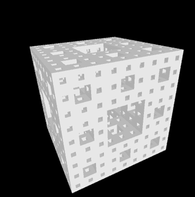

# Menger Sponge Fractal

Menger Sponge Fractal provides an animation of a rotating Menger sponge fractal with higher resolution generated on demand (click).  
Start date: 2019-09-05  

## Demo

## Dependencies

- [Processing 4.0 beta 1](https://processing.org/download)

## Installation

- Open Processing (IDE).
- Open any of the `*.pde` files with Processing (IDE).

## Usage

1. Launch the program using Processing (IDE).
1. Click the display to increase the definition of the fractal. Use the up and down arrow keys to scale (up and down respectively) each box in the fractal. Use the left and right arrow keys to respectively lower and raise the amount by which the size of children boxes (generated upon click) are shrunk by. Use the `f` and `s` keys to speed up and slow down the rotation rate of the fractal, respectively.
1. Review exact values in the console.

Note that simulation speed decreases exponentially with the number of simulated fractal levels.

## Acknowledgements

- Inspired by [a video on YouTube](https://www.youtube.com/watch?v=LG8ZK-rRkXo).

## Author

- **Jeffrey Andersen** &mdash; [GitHub Profile](https://github.com/anderjef) &bull; [Website](https://anderjef.github.io)

## License

For copyright, license, and warranty, see [LICENSE.md](LICENSE.md).
